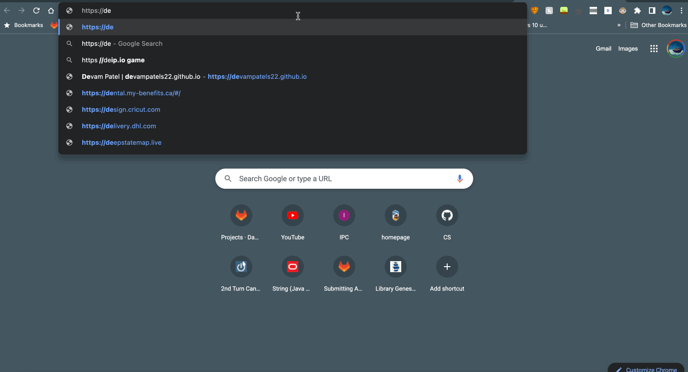

# Host Resume as Markdown format File.
## Purpose
--------------------
- The purpose of this README file is to introduce users to specific steps of creating a resume on markdown. This project will also include some of the key principles that are mentioned in *Andrew Etter's Book Modern Technical Writing* Link to the book can be found under "More Resources" of the **instruction** section.

## Prerequisites
--------------------
Three components are required to host our resume as a markdown file on GitHub with the help of Jekyll.

**Resume Standards**
- To create a resume in markdown format we first require a formatted resume that meets the [University Of Manitoba career services standards.](https://umanitoba.ca/student/careerservices/media/Resume.pdf).

**Markdown tool**
- I have been using VS CODE to create and edit my markdown due to my experience with VS CODE tools and interfaces. But feel free to use any editors of your choice. [Here](https://www.oberlo.ca/blog/markdown-editors) are the top most editors that can be useful for beginners. I highly recommend first-time users to check out "More resources" for one of the best markdown tutorials.

**GitHub Pages**
- GitHub is an online distribution platform that lets users store and share their repositories on the cloud with at zero cost. You are required to have a GitHub account for this project therefore click [here](https://github.com) to sign up.

## Instructions
--------------------
First I will talk about the importance of a Markdown file for Lightweight Markup.
> Based on Etter's book lightweight markup file should be direct with a simple set of features that can be implemented in a short period of time. There are multiple lightweight markup languages, but we will only talk about Markdown. It is one of the efficient ways to document  since it is simple, free, and user-friendly. Furthermore, the Markdown format is easy to read and easily publishable for static websites. On the other hand, writing in XML is tedious and time-consuming because of its complexity. 
These are some of the reasons why we will be using markdown format markup files.

### GitHub pages
From Etter's Book, the use of Distributed Version Control (DVCS) is efficient. 
> Multiple developers need to access files and repositories. They can use DVCS to work simultaneously with high performance in the project compared to a centralized system. DVCS also favors developers learning from the repositories that are posted publicly on the servers. 
From Andrew's recommendations, we will use GitHub to host our resume. You will first start by creating your repository using the steps indicated below.

Create new repository
1. Go to [GitHub Login Page](https://github.com/login) to log in or sign up.
2.  Locate **New** button to create new repositories on the left section of the page and click on it.
3. Fill out the *Repository Name* as ``[your-github-name].github.io``
4. Adding a `description` is optional.
5. Make sure the repository is set to `public`.
6. `Unchecked` the check box for `README File`.
7. Set the `.gitignore` template to **None**.
8. Set `Choose a license` to **None**.

Once the new repository has been created.
We will add files into the repository
1. locate the **`Quick setup`** section.
2. Click on `uploading an existing file` to add files from your local machine.
3. Locate and click on `choose your files`.
4. Upload your resume as`[index.md]` file. **Important: Filename name should be identical**
5. Add a description to keep track in the future.
6. Remember to click the `commit changes` button.

### Hosting your Website
> The author Andrew Etter favors static websites over dynamic ones because he loved the fact that they are simple, portable, reliable, and fast. Hosting a static website is straightforward and requires a minimal requirement of education. Developers can use built-in Jekyll software implemented in GitHub or use software like ruby to generate a pleasant style.

I will show steps to both methods of hosting a static website.
First with Ruby and Jekyll and second with GitHub.

**Using Ruby and Jekyll**

1. Install Ruby
    1. Go to the [Ruby website](https://www.ruby-lang.org/en/documentation/installation/) and follow the necessary steps to install ruby according to the specification of the local machine (MacOS or Windows).
    2. Type in `ruby -v` on your terminal/cmd to confirm the installation of ruby.
2. Install Jekyll
    1. Check out the [Quick-start](https://jekyllrb.com/docs/) page for prerequisites/requirements then go to the [Jekyll installation page](https://jekyllrb.com/docs/installation/) and follow the necessary steps to install Jekyll based on the specification of your local machine.
    2. Type in `jekyll -v` on your terminal to confirm the installation of ruby.
3. Create static website
    1. Locate and open the terminal on your machine.
    2. Open the folder in which your resume and readme files are saved in
    3. Run command on terminal `jekyll new [your-github-name].github.io`
4. Making a static website
    1. Navigate to `settings` in your `[your-github-name].github.io` repository.
    2. Jekyll has created the website on our local machine
    3. Run `bundle exec jekyll build` to execute the new website.

**Using GitHub static website powered by Jekyll**
1. Go to your preferred browser and type in `https://[your-github-name].github.io`
        - You will successfully be able to open the website with your resume.
2. Customize theme
    1. Browse to `settings` in your GitHub page repository where your files are located.
    2. Locate `Pages` on the left index section of the webpage.
    3. Locate the button: `add a jekyll theme` link on the webpage.
    4. Follow the necessary steps shown in adding a theme section in the [GitHub documentation.](https://docs.github.com/en/pages/setting-up-a-github-pages-site-with-jekyll/adding-a-theme-to-your-github-pages-site-using-jekyll)

Here is an example of my resume hosted on GitHub by Jekyll.

### More Resources
- [Markdown](https://commonmark.org/help/tutorial/02-emphasis.html)
- [Modern Technical Writing Book](https://www.goodreads.com/en/book/show/28433138-modern-technical-writing)
- [GitHub Tutorial](https://product.hubspot.com/blog/git-and-github-tutorial-for-beginners)

## Authors and Acknowledgments
--------------------
- Andrew Etter
- Devam Patel

## FAQs
--------------------
**Why is Markdown better than a word processor?**

Using markdown is very simple and efficient. Simple in the sense that you are not required to learn multiple features to fully use the markdown editors compared to Microsoft word or any other editors. Furthermore, markdown file gives you an extra level of flexibility as you can use [Pandoc](https://pandoc.org/MANUAL.html) to convert from .md to any other format (Few popular formats: .html, .pdf, .latex, .docx with 25+ other formats).

**Why is my resume not showing up?**

There can few issues related to this topic.
- The file name is not `index.md`. Jekyll Integrated in GitHub by default looks for default filenames such as index. Therefore this configuration is important.
- Final changes should be located in the main or master branch in GitHub. Make sure to commit if you are using any other branches for example development.

